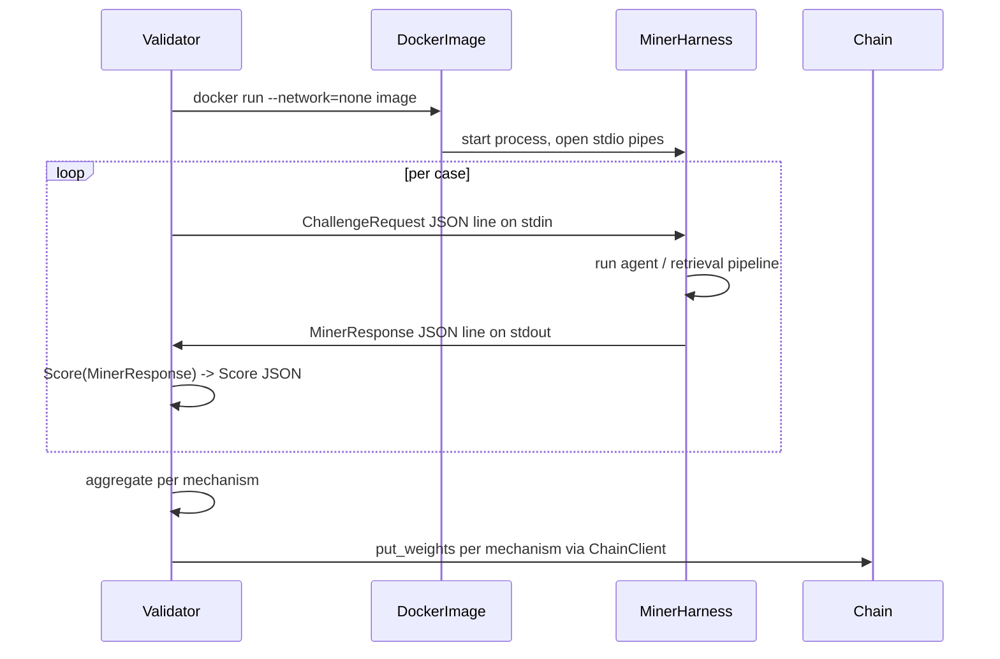

# DittoBench protocol (harness-in-Docker)

This document is the contract between DittoBench validators and miner
harness images on Bittensor subnet 118. The Python reference implementation
lives in [`../runner/`](../runner); JSON schemas are in
[`../schemas/`](../schemas).

Schema version: `dittobench/1` (see
[`../__init__.py`](../__init__.py) ``SCHEMA_VERSION``).

## Submission unit

A miner submits a **Go harness packaged as an OCI image**, not a live
network service. The validator runs each submission locally in an isolated
Docker container, drives it over stdio with the JSON protocol below, scores
the responses, and sets per-mechanism weights on chain.

The interfaces the harness must satisfy are documented in
[`harness_interface.md`](harness_interface.md). The Docker contract
(`--network=none`, resource limits, env vars, reproducibility) is also
defined there.

## Mechanisms

| ID                 | Name             | Mechanism index | Maps to Ditto product value                          |
|--------------------|------------------|-----------------|------------------------------------------------------|
| `ditto_core`       | DittoCore        | 0               | Tool selection + arguments + abstention discipline   |
| `ditto_retrieval`  | DittoRetrieval   | 1               | Memory recall, grounding, abstention, contradiction  |

A harness may implement one or both mechanisms. Cases tagged for an
unsupported mechanism are answered with a `refusal` response and scored as
zero for that case without affecting the other mechanism.

## Round trip



1. The validator picks a case from the relevant fixture split (`public`,
   `private`, or `canary`) and builds a `ChallengeRequest` populated for
   the target mechanism.
2. The validator launches the miner's harness container with stdio
   pipes and sandbox limits (see [`harness_interface.md`](harness_interface.md)).
3. The validator writes one JSON line per `ChallengeRequest` on stdin; the
   harness writes one JSON line per `MinerResponse` on stdout.
4. The validator scores each response with the helpers in
   [`../runner/scoring.py`](../runner/scoring.py) (Python port of the
   canonical Go scorer) and records a `Score` with a per-component breakdown.
5. At the end of each tempo, the validator aggregates per-miner scores
   per mechanism and commits an `AggregateWeights` to chain via the Yuma
   Consensus weight-setting flow (see
   [`ditto/chain/client.py`](../../chain/client.py) ``put_weights``).

## Request shape

```jsonc
{
  "schema_version": "dittobench/1",
  "challenge_id":   "01HXYZ...",            // validator-chosen opaque ID
  "mechanism":      "ditto_core",
  "case_id":        "search-memories-paraphrase",
  "category":       "memory_lookup",
  "domain":         "personal_recall_routing",

  // Core fields (omitted for ditto_retrieval challenges):
  "prompt":         "Remind me of that recipe I bookmarked recently",
  "tool_schemas":   [...],                   // canonical Ditto chat v2 schemas
  "stm_context":    [],

  // Retrieval fields (omitted for ditto_core challenges):
  "query":            "What is my favorite programming language right now?",
  "k":                10,
  "user_fixture_id":  "dittobench_fixture_alice",
  "fixture_bundle":   "ipfs://...",          // optional seeded corpus handle
  "include_answer":   true,

  // Anti-gaming controls:
  "validator_seed":  "1c4f...e9b2",
  "issued_at":       "2026-05-15T17:00:00Z",
  "deadline_ms":     8000
}
```

The canonical JSON schema is
[`../schemas/challenge_request.schema.json`](../schemas/challenge_request.schema.json).

## Response shape

```jsonc
{
  "schema_version": "dittobench/1",
  "challenge_id":   "01HXYZ...",
  "miner_hotkey":   "5G...",
  "validator_seed": "1c4f...e9b2",            // must echo back

  "tool_calls":   [                            // present for ditto_core
    {"hop": 1, "name": "search_memories",
     "args": "{\"queries\":[\"recipe bookmarks\"]}"}
  ],

  "evidence_ids": [                            // present for ditto_retrieval
    "fix_alice_pref_language_rust_01"
  ],

  "final_answer": "Rust — you've been working through Rust on weekends.",

  "started_at":         "2026-05-15T17:00:00.123Z",
  "finished_at":        "2026-05-15T17:00:01.011Z",
  "total_latency_ms":   888,
  "first_token_ms":     341,
  "prompt_tokens":      1240,
  "output_tokens":       96,
  "estimated_cost_usd": 0.0012
}
```

The canonical JSON schema is
[`../schemas/miner_response.schema.json`](../schemas/miner_response.schema.json).

### Refusal

A miner that cannot or does not want to participate in a mechanism may
return:

```jsonc
{
  "schema_version": "dittobench/1",
  "challenge_id":   "01HXYZ...",
  "validator_seed": "1c4f...e9b2",
  "refusal":        "mechanism_unsupported"
}
```

Refusals are scored as zero for the case at hand but do not affect the
miner's other mechanism.

## I/O framing rules

The validator and harness exchange **newline-delimited JSON** (one JSON
object per line, terminated by `\n`). Implementations MUST:

- Write to and read from a single stdio pair (no other side channels).
- Emit exactly one response line per request line, in the same order.
- Avoid printing any non-JSON output on stdout. Logging belongs on stderr.
- Flush stdout after each response so the validator can stream the run.
- Tolerate the validator closing stdin to signal end-of-run; the harness
  should then drain in-flight responses and exit with status `0`.

Implementations MAY use any line-buffered framing helper (e.g. Go's
`bufio.Scanner` with a generous buffer size). The reference template at
[`harness/go-template/`](../../../harness/go-template/) ships a ready-made
framing loop.

## Scoring summary

See [`scoring.md`](scoring.md) for the full breakdown. Each `Score`
record published by a validator includes a `breakdown` map so auditors
can confirm component weights without re-running the case.

| Mechanism        | Component               | Weight |
|------------------|-------------------------|--------|
| `ditto_core`     | `tool_selection_f1`     | 0.50   |
| `ditto_core`     | `arg_quality_f1`        | 0.25   |
| `ditto_core`     | `sequence_score`        | 0.15   |
| `ditto_core`     | `latency_score`         | 0.10   |
| `ditto_retrieval`| `evidence_metrics`      | 0.45   |
| `ditto_retrieval`| `grounded_answer`       | 0.25   |
| `ditto_retrieval`| `abstain_contradiction` | 0.15   |
| `ditto_retrieval`| `stm_ltm_routing`       | 0.10   |
| `ditto_retrieval`| `latency_score`         | 0.05   |

`mcp_parity` is published in the breakdown for visibility but does not
enter the weighted sum; failures below 0.9 generate a
`mcp_parity_below_gate` note that subnet operators surface in dashboards.

## Splits and visibility

`visibility` is stamped by the validator on `Score` records after grading.

- `public`: bundled with the public test data and freely available. Used
  for smoke tests, regression baselines, and onboarding miners.
- `private`: shipped only inside the validator-only manifest. Reshuffled
  on a cadence so miners cannot cache responses across tempos.
- `canary`: hidden cases drawn from a paraphrase generator over the
  public set. A miner whose `public` score is high but whose `canary`
  score is low is evidence of memorisation; validators apply an
  anti-memorisation discount documented in [`anti_gaming.md`](anti_gaming.md).

## Determinism guarantees

- Every challenge embeds a `validator_seed` the miner must echo back.
  Lost or duplicated seeds are treated as protocol violations.
- Validators issue identical challenges with identical seeds to multiple
  miners so consensus can be compared across the metagraph.
- All score breakdowns are deterministic functions of the response;
  LLM-judge components are only enabled for retrieval challenges with
  `include_answer` set, and the judge model is documented per-tempo so
  two validators reach the same numbers.
- Validators MUST pin the harness image by digest in their commitment
  artefact; see [`anti_gaming.md`](anti_gaming.md#docker-image-digest-pinning).
